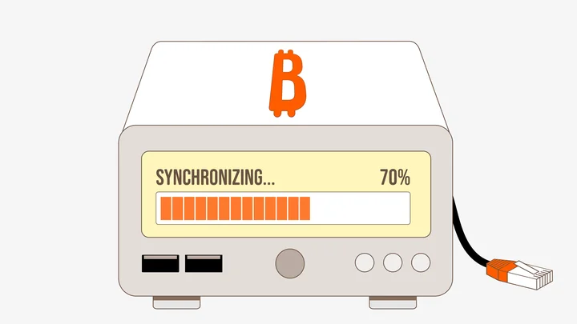
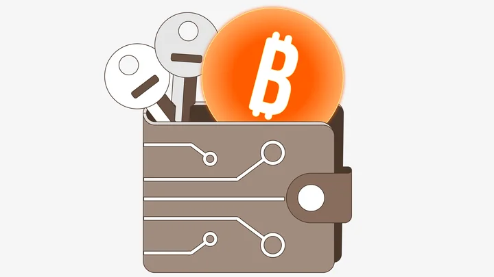
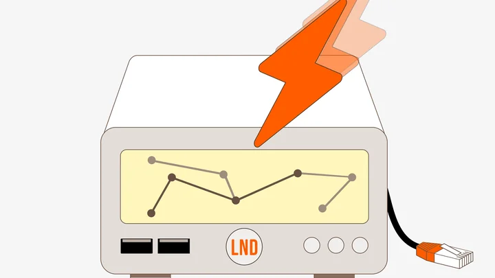
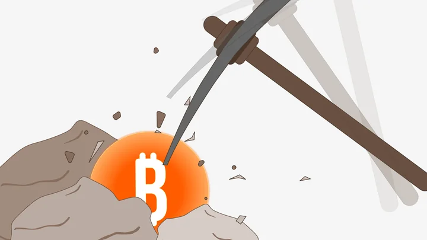
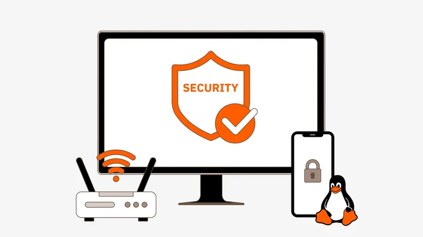

  <h1>> J'écris des contenus pédagogiques sur Bitcoin.</h1>

---

# Dictionnaire de Bitcoin

- [Tout le vocabulaire technique de Bitcoin]({{ '/dictionnaire/' | relative_url }})

---

# Formations pour Plan ₿ Academy

## BTC 202 - [Mettre en place son premier nœud Bitcoin](https://planb.academy/fr/courses/3cd9cb94-82e8-417a-9c5a-02afc2589426)

Comprendre, installer, configurer et utiliser un nœud Bitcoin

- [1 - Aperçu du cours](https://planb.academy/fr/courses/3cd9cb94-82e8-417a-9c5a-02afc2589426/916b1f86-38a4-4ede-bdb7-83841d5a7abe)
- [2 - Qu’est-ce qu’un nœud Bitcoin ?](https://planb.academy/fr/courses/3cd9cb94-82e8-417a-9c5a-02afc2589426/0a9fd4e0-94ab-405e-924c-023397393027)
- [3 - Quelle est la différence entre un nœud et un portefeuille ?](https://planb.academy/fr/courses/3cd9cb94-82e8-417a-9c5a-02afc2589426/de5af634-a628-4b90-b869-468c208e178b)
- [4 - Quelle est la différence entre un nœud et un mineur ?](https://planb.academy/fr/courses/3cd9cb94-82e8-417a-9c5a-02afc2589426/d2992614-7ab7-4bf9-81b1-f548cda67257)
- [5 - Bitcoin Core et les implémentations du protocole](https://planb.academy/fr/courses/3cd9cb94-82e8-417a-9c5a-02afc2589426/72381876-9317-4faa-8d41-2b252a945b8a)
- [6 - Pourquoi faire tourner son propre nœud ?](https://planb.academy/fr/courses/3cd9cb94-82e8-417a-9c5a-02afc2589426/39c0cd19-67f9-4c64-bfb3-dbd6eec0bf42)
- [7 - Les différents types de nœuds Bitcoin](https://planb.academy/fr/courses/3cd9cb94-82e8-417a-9c5a-02afc2589426/be8f0baa-41f2-4b54-b011-092f4ccc93aa)
- [8 - Panorama des solutions logicielles](https://planb.academy/fr/courses/3cd9cb94-82e8-417a-9c5a-02afc2589426/0d48b89a-e8b5-441e-a707-537a035fc15e)
- [9 - Panorama des solutions matérielles](https://planb.academy/fr/courses/3cd9cb94-82e8-417a-9c5a-02afc2589426/245d6add-9cda-46b9-9343-31dcdd70456e)
- [10 - Umbrel : bien plus qu'un nœud Bitcoin](https://planb.academy/fr/courses/3cd9cb94-82e8-417a-9c5a-02afc2589426/dd4c04f1-924a-43e1-94f3-ea9fbc83dd43)
- [11 - Installation d’un nœud complet avec Umbrel](https://planb.academy/fr/courses/3cd9cb94-82e8-417a-9c5a-02afc2589426/61bc09c7-787d-4649-b142-457ec018b0f4)
- [12 - Les indexeurs : rôle, fonctionnement et solutions](https://planb.academy/fr/courses/3cd9cb94-82e8-417a-9c5a-02afc2589426/4f93c07a-f0cb-435f-8b68-162f316d7039)
- [13 - Comment connecter son portefeuille à son nœud Bitcoin ?](https://planb.academy/fr/courses/3cd9cb94-82e8-417a-9c5a-02afc2589426/35519b1a-f681-4a69-a652-9fbe510cd17f)
- [14 - Tour d’horizon des applications disponibles](https://planb.academy/fr/courses/3cd9cb94-82e8-417a-9c5a-02afc2589426/2a5ccfbe-0b17-44c9-863c-b7e8cb4b4594)
- [15 - Entretenir son nœud Umbrel](https://planb.academy/fr/courses/3cd9cb94-82e8-417a-9c5a-02afc2589426/06d77d09-bf24-4555-b2ba-c08bbda477c7)
- [16 - Comprendre l’IBD et le processus de découverte des pairs](https://planb.academy/fr/courses/3cd9cb94-82e8-417a-9c5a-02afc2589426/175ac9d1-ea23-45d9-9918-d3e7352435cd)
- [17 - Anatomie de votre nœud Bitcoin](https://planb.academy/fr/courses/3cd9cb94-82e8-417a-9c5a-02afc2589426/b420bd9d-7e2a-4984-bc70-2b732a94c8ce)
- [18 - Comprendre le fichier bitcoin.conf](https://planb.academy/fr/courses/3cd9cb94-82e8-417a-9c5a-02afc2589426/c54a629a-ddb1-41cb-9a88-21dfd9be50ca)
- [19 - Avis & Notes](https://planb.academy/fr/courses/3cd9cb94-82e8-417a-9c5a-02afc2589426/c18f672d-1074-427e-9505-eecd7ae43e71)
- [20 - Examen final](https://planb.academy/fr/courses/3cd9cb94-82e8-417a-9c5a-02afc2589426/a4c97701-996c-4cc5-81fa-37d2dc4ee856)
- [21 - Conclusion](https://planb.academy/fr/courses/3cd9cb94-82e8-417a-9c5a-02afc2589426/28c5cf1f-7b9c-4b68-8b8f-eee109629764)

---

## BTC 204 - [La confidentialité sur Bitcoin](https://planb.academy/fr/courses/65c138b0-4161-4958-bbe3-c12916bc959c)

Comprendre et maîtriser les principes de la protection de la vie privée dans l'utilisation de Bitcoin

- [1 - Aperçu du cours](https://planb.academy/fr/courses/65c138b0-4161-4958-bbe3-c12916bc959c/08ba1933-f393-4fb5-8279-777d874caedb)
- [2 - Le modèle d'UTXO de Bitcoin](https://planb.academy/fr/courses/65c138b0-4161-4958-bbe3-c12916bc959c/8d6b50c5-bf74-44f4-922b-25204991cb75)
- [3 - La structure des transactions Bitcoin](https://planb.academy/fr/courses/65c138b0-4161-4958-bbe3-c12916bc959c/29d3aaab-de2e-4746-ab40-c9748898850c)
- [4 - Le modèle de confidentialité de Bitcoin](https://planb.academy/fr/courses/65c138b0-4161-4958-bbe3-c12916bc959c/769d8963-3ed5-4094-b21d-9203c7d9e465)
- [5 - C'est quoi l'analyse de chaîne sur Bitcoin ?](https://planb.academy/fr/courses/65c138b0-4161-4958-bbe3-c12916bc959c/7d198ba6-4af2-4f24-86cb-3c79cb25627e)
- [6 - Les patterns de transactions](https://planb.academy/fr/courses/65c138b0-4161-4958-bbe3-c12916bc959c/d365a101-2d37-46a5-bfb9-3c51e37bf96b)
- [7 - Les heuristiques internes](https://planb.academy/fr/courses/65c138b0-4161-4958-bbe3-c12916bc959c/c54b5abe-872f-40f4-a0d0-c59faff228ba)
- [8 - Les heuristiques externes](https://planb.academy/fr/courses/65c138b0-4161-4958-bbe3-c12916bc959c/4a170e3b-200d-431a-8285-18a23ff617ba)
- [9 - Mise en pratique avec un explorateur de blocs](https://planb.academy/fr/courses/65c138b0-4161-4958-bbe3-c12916bc959c/6493cf2f-225c-405f-9375-c4304f1087ed)
- [10 - La réutilisation d'adresse](https://planb.academy/fr/courses/65c138b0-4161-4958-bbe3-c12916bc959c/f3e97645-3df3-41bc-a4ed-d2c740113d96)
- [11 - L'étiquetage et le contrôle des pièces](https://planb.academy/fr/courses/65c138b0-4161-4958-bbe3-c12916bc959c/fbdb07cd-c025-48f2-97b0-bd1bc21c68a8)
- [12 - Le KYC et l'identification des clés](https://planb.academy/fr/courses/65c138b0-4161-4958-bbe3-c12916bc959c/cec6b9d9-0eed-4f85-bc4e-1e9aa59ca605)
- [13 - Les méthodes de vente et d'acquisition](https://planb.academy/fr/courses/65c138b0-4161-4958-bbe3-c12916bc959c/756598af-95aa-4c77-ac48-243c7ad89530)
- [14 - La consolidation, la gestion des UTXOs et la CIOH](https://planb.academy/fr/courses/65c138b0-4161-4958-bbe3-c12916bc959c/d0486c8f-332d-402b-ae2e-949416752b9c)
- [15 - Les autres bonnes pratiques](https://planb.academy/fr/courses/65c138b0-4161-4958-bbe3-c12916bc959c/b5216965-7d13-4ea1-9b7c-e292966a487b)
- [16 - C'est quoi une transaction coinjoin ?](https://planb.academy/fr/courses/65c138b0-4161-4958-bbe3-c12916bc959c/0862bc6b-1c48-4aa4-b76d-4f547b469008)
- [17 - Zerolink et chaumian coinjoins](https://planb.academy/fr/courses/65c138b0-4161-4958-bbe3-c12916bc959c/326c9654-b359-4906-b23d-d6518dd5dc3e)
- [18 - Les implémentations de coinjoin](https://planb.academy/fr/courses/65c138b0-4161-4958-bbe3-c12916bc959c/e37ed073-9498-4e4f-820b-30951e829596)
- [19 - Le fonctionnement de Whirlpool](https://planb.academy/fr/courses/65c138b0-4161-4958-bbe3-c12916bc959c/bdbd7109-e36d-4b4f-a3c6-928df4e9bfda)
- [20 - Les ensembles d'anonymat](https://planb.academy/fr/courses/65c138b0-4161-4958-bbe3-c12916bc959c/be1093dc-1a74-40e5-9545-2b97a7d7d431)
- [21 - L'entropie](https://planb.academy/fr/courses/65c138b0-4161-4958-bbe3-c12916bc959c/e4fe289d-618b-49a2-84c9-68c562e708b4)
- [22 - Les transactions payjoin](https://planb.academy/fr/courses/65c138b0-4161-4958-bbe3-c12916bc959c/c1e90b95-f709-4574-837b-2ec26b11286f)
- [23 - Les mini-coinjoins de paiement](https://planb.academy/fr/courses/65c138b0-4161-4958-bbe3-c12916bc959c/300777ee-30ae-43d7-ab00-479dac3522c1)
- [24 - Les ricochets](https://planb.academy/fr/courses/65c138b0-4161-4958-bbe3-c12916bc959c/db9a20ac-a149-443d-884b-ea6c03f28499)
- [25 - Les transferts secrets de propriété](https://planb.academy/fr/courses/65c138b0-4161-4958-bbe3-c12916bc959c/a2067036-849c-4d6b-87d2-44235cfae7a1)
- [26 - La confidentialité sur le réseau P2P](https://planb.academy/fr/courses/65c138b0-4161-4958-bbe3-c12916bc959c/04a2467b-db84-4076-a9ff-919be5135106)
- [27 - BIP47 et codes de paiements réutilisables](https://planb.academy/fr/courses/65c138b0-4161-4958-bbe3-c12916bc959c/ad88e076-a04b-4aec-b3b2-7b4760175504)
- [28 - Silent Payments](https://planb.academy/fr/courses/65c138b0-4161-4958-bbe3-c12916bc959c/2871d594-414e-4598-a830-91c9eb84dfb8)
- [29 - Avis & Notes](https://planb.academy/fr/courses/65c138b0-4161-4958-bbe3-c12916bc959c/195d149f-80fa-5816-8b46-995a9226d082)
- [30 - Examen final](https://planb.academy/fr/courses/65c138b0-4161-4958-bbe3-c12916bc959c/e803d394-e3c1-5816-a6b4-a69a2472019c)
- [31 - Conclusion](https://planb.academy/fr/courses/65c138b0-4161-4958-bbe3-c12916bc959c/cd8e5c67-50e4-4dcd-8e04-88ba5ec95305)

---

## CYP 201 - [Architecture du portefeuille Bitcoin](https://planb.academy/fr/courses/46b0ced2-9028-4a61-8fbc-3b005ee8d70f)

Plongez dans les principes cryptographiques qui font fonctionner les portefeuilles Bitcoin.

- [1 - Introduction de la formation](https://planb.academy/fr/courses/46b0ced2-9028-4a61-8fbc-3b005ee8d70f/fb4e8857-ea35-5a8a-ae8a-5300234e0104)
- [2 - Introduction aux fonctions de hachage](https://planb.academy/fr/courses/46b0ced2-9028-4a61-8fbc-3b005ee8d70f/dba011f5-1805-5a48-ac2b-4bd637c93703)
- [3 - Les rouages de SHA256](https://planb.academy/fr/courses/46b0ced2-9028-4a61-8fbc-3b005ee8d70f/905eb320-f15b-5fb6-8d2d-5bb447337deb)
- [4 - Les algorithmes utilisés pour la dérivation](https://planb.academy/fr/courses/46b0ced2-9028-4a61-8fbc-3b005ee8d70f/cc668121-7789-5e99-bf5e-1ba085f4f5f2)
- [5 - Signatures numériques et courbes elliptiques](https://planb.academy/fr/courses/46b0ced2-9028-4a61-8fbc-3b005ee8d70f/c9dd9672-6da1-57f8-9871-8b28994d4c1a)
- [6 - Calculer la clé publique à partir de la clé privée](https://planb.academy/fr/courses/46b0ced2-9028-4a61-8fbc-3b005ee8d70f/fcb2bd58-5dda-5ecf-bb8f-ad1a0561ab4a)
- [7 - Signer avec la clé privée](https://planb.academy/fr/courses/46b0ced2-9028-4a61-8fbc-3b005ee8d70f/bb07826f-826e-5905-b307-3d82001fb778)
- [8 - Les sighash flags](https://planb.academy/fr/courses/46b0ced2-9028-4a61-8fbc-3b005ee8d70f/231c41a2-aff2-4655-9048-47b6d2d83d64)
- [9 - Évolution des portefeuilles Bitcoin](https://planb.academy/fr/courses/46b0ced2-9028-4a61-8fbc-3b005ee8d70f/9d9acd5d-a0e5-5dfd-b544-f043fae8840f)
- [10 - Entropie et nombre aléatoire](https://planb.academy/fr/courses/46b0ced2-9028-4a61-8fbc-3b005ee8d70f/b43c715d-affb-56d8-a697-ad5bc2fffd63)
- [11 - La phrase mnémonique](https://planb.academy/fr/courses/46b0ced2-9028-4a61-8fbc-3b005ee8d70f/8f9340c1-e6dc-5557-a2f2-26c9669987d5)
- [12 - La passphrase](https://planb.academy/fr/courses/46b0ced2-9028-4a61-8fbc-3b005ee8d70f/6a51b397-f3b5-5084-b151-cef94bc9b93f)
- [13 - Création de la graine et de la clé maîtresse](https://planb.academy/fr/courses/46b0ced2-9028-4a61-8fbc-3b005ee8d70f/63093760-2010-5691-8d0e-9a04732ae557)
- [14 - Les clés étendues](https://planb.academy/fr/courses/46b0ced2-9028-4a61-8fbc-3b005ee8d70f/8dcffce1-31bd-5e0b-965b-735f5f9e4602)
- [15 - Dérivation des paires de clés enfants](https://planb.academy/fr/courses/46b0ced2-9028-4a61-8fbc-3b005ee8d70f/61c0807c-845b-5076-ad06-7f395b36adfd)
- [16 - Structure du portefeuille et chemins de dérivation](https://planb.academy/fr/courses/46b0ced2-9028-4a61-8fbc-3b005ee8d70f/34e1bbda-67de-5493-b268-1fded8d67689)
- [17 - Output script descriptors](https://planb.academy/fr/courses/46b0ced2-9028-4a61-8fbc-3b005ee8d70f/e4f1c2d3-9b8a-4d3e-8f2a-7b6c5d4e3f2a)
- [18 - Les adresses de réception](https://planb.academy/fr/courses/46b0ced2-9028-4a61-8fbc-3b005ee8d70f/ca80a89d-f8da-4e09-8c35-43179b65bced)
- [19 - Dérivation des adresses](https://planb.academy/fr/courses/46b0ced2-9028-4a61-8fbc-3b005ee8d70f/3ebdc750-4135-4881-b07e-08965941b93e)
- [20 - Avis & Notes](https://planb.academy/fr/courses/46b0ced2-9028-4a61-8fbc-3b005ee8d70f/0cd71541-a7fd-53db-b66a-8611b6a28b04)
- [21 - Examen final](https://planb.academy/fr/courses/46b0ced2-9028-4a61-8fbc-3b005ee8d70f/a53ea27d-0f84-56cd-b37c-a66210a4b31d)
- [22 - Conclusion](https://planb.academy/fr/courses/46b0ced2-9028-4a61-8fbc-3b005ee8d70f/d291428b-3cfa-5394-930e-4b514be82d5a)

---

## LNP 202 - [Mettre en place son premier nœud Lightning](https://planb.academy/fr/courses/593e483e-1785-4e83-aa7e-32b99056844c)

Comprendre, installer, configurer et utiliser un nœud Lightning

- [1 - Aperçu du cours](https://planb.academy/fr/courses/593e483e-1785-4e83-aa7e-32b99056844c/e0871abf-af6d-4221-9389-1a996aea9b79)
- [2 - Comprendre ce qu'est un nœud Lightning](https://planb.academy/fr/courses/593e483e-1785-4e83-aa7e-32b99056844c/8275dfd8-7a72-48cc-bf7f-bc2a46063003)
- [3 - Pourquoi exploiter son propre nœud Lightning ?](https://planb.academy/fr/courses/593e483e-1785-4e83-aa7e-32b99056844c/421db24e-511c-41ed-ad68-69b0662042ea)
- [4 - Choisir la solution adaptée à son usage](https://planb.academy/fr/courses/593e483e-1785-4e83-aa7e-32b99056844c/615870e3-741d-4ec1-875d-a483e70f39d4)
- [5 - Installer LND avec Umbrel](https://planb.academy/fr/courses/593e483e-1785-4e83-aa7e-32b99056844c/a0014bf3-1bd3-4311-b15b-5ef2354ec744)
- [6 - Sauvegarder son nœud Lightning](https://planb.academy/fr/courses/593e483e-1785-4e83-aa7e-32b99056844c/638fa75d-62af-4bf3-ab4a-b7d10ea75815)
- [7 - Watchtower : rôle et mise en place](https://planb.academy/fr/courses/593e483e-1785-4e83-aa7e-32b99056844c/e6c654dd-26c5-4e4d-8d11-a215bac37812)
- [8 - Ouvrir son premier canal Lightning](https://planb.academy/fr/courses/593e483e-1785-4e83-aa7e-32b99056844c/00642af7-8f3d-4a25-96d7-34e85de7bd5d)
- [9 - Définir son profil d'opérateur de nœud](https://planb.academy/fr/courses/593e483e-1785-4e83-aa7e-32b99056844c/d3b2e163-50f6-4d1d-a5fc-8fd177dfac76)
- [10 - Utiliser un gestionnaire de nœud Lightning](https://planb.academy/fr/courses/593e483e-1785-4e83-aa7e-32b99056844c/02eb4c09-d14b-4ff0-8b04-b90de3307d34)
- [11 - Obtenir de la liquidité entrante](https://planb.academy/fr/courses/593e483e-1785-4e83-aa7e-32b99056844c/b740c656-a897-4d95-af4b-116b718447cd)
- [12 - Connecter un portefeuille mobile via Tailscale](https://planb.academy/fr/courses/593e483e-1785-4e83-aa7e-32b99056844c/5fefb222-3f50-4f9d-a170-2ea628be4437)
- [13 - Connecter un portefeuille mobile via NWC](https://planb.academy/fr/courses/593e483e-1785-4e83-aa7e-32b99056844c/f5c97e43-e66e-4ba3-bcc9-fee1a04fc7f4)
- [14 - Pérenniser son autonomie sur Lightning](https://planb.academy/fr/courses/593e483e-1785-4e83-aa7e-32b99056844c/691a0942-b46d-482a-8fbc-fe19b3814992)
- [15 - Avis & Notes](https://planb.academy/fr/courses/593e483e-1785-4e83-aa7e-32b99056844c/aec048c7-7130-425d-8eca-9cd7f90c27f3)
- [16 - Examen final](https://planb.academy/fr/courses/593e483e-1785-4e83-aa7e-32b99056844c/3951ccbb-14a3-4322-b81b-8dd2a6da19cb)
- [17 - Conclusion](https://planb.academy/fr/courses/593e483e-1785-4e83-aa7e-32b99056844c/30cd6309-5139-40d9-8927-92de0f76414a)

---

## MIN 101 - [Introduction au minage de Bitcoin](https://planb.academy/fr/courses/d1ce86d9-c983-49bc-92b3-e3c5269f239e)

Tout comprendre du minage de Bitcoin et de la preuve de travail, en partant de zéro

- [1 - Aperçu du cours](https://planb.academy/fr/courses/d1ce86d9-c983-49bc-92b3-e3c5269f239e/a82d49dc-d68a-4e3f-985e-bcef6643677e)
- [2 - Le minage de Bitcoin expliqué simplement](https://planb.academy/fr/courses/d1ce86d9-c983-49bc-92b3-e3c5269f239e/278577a6-98bb-4659-86c7-f6c4f6d5fa3e)
- [3 - Le parcours de la transaction Bitcoin](https://planb.academy/fr/courses/d1ce86d9-c983-49bc-92b3-e3c5269f239e/3b7a3502-4814-4554-8de1-86ac961a2958)
- [4 - La construction d'un bloc Bitcoin](https://planb.academy/fr/courses/d1ce86d9-c983-49bc-92b3-e3c5269f239e/2b5cd04b-d400-4865-b0a0-e70fa7e67c17)
- [5 - Le hachage, la cible et le nonce](https://planb.academy/fr/courses/d1ce86d9-c983-49bc-92b3-e3c5269f239e/d054323b-16bd-4556-bac5-4878654e59a3)
- [6 - L'histoire de la preuve de travail](https://planb.academy/fr/courses/d1ce86d9-c983-49bc-92b3-e3c5269f239e/919d9f3e-8b3b-41d9-b45a-54df4f3c31a3)
- [7 - L'ajustement de la cible de difficulté](https://planb.academy/fr/courses/d1ce86d9-c983-49bc-92b3-e3c5269f239e/528bcaa8-351e-4eae-887a-426a78a223e3)
- [8 - La récompense de bloc](https://planb.academy/fr/courses/d1ce86d9-c983-49bc-92b3-e3c5269f239e/b316fb89-9c18-417e-917b-ab98f1722646)
- [9 - Le halving](https://planb.academy/fr/courses/d1ce86d9-c983-49bc-92b3-e3c5269f239e/7cdca211-7300-48f8-a1e4-53e5c2678cd8)
- [10 - La transaction coinbase](https://planb.academy/fr/courses/d1ce86d9-c983-49bc-92b3-e3c5269f239e/69476700-3616-4aab-b006-367aba059de9)
- [11 - L'évolution des machines de minage](https://planb.academy/fr/courses/d1ce86d9-c983-49bc-92b3-e3c5269f239e/2d2f9055-75fd-4630-b493-a577d708a39f)
- [12 - Le regroupement en pools de minage](https://planb.academy/fr/courses/d1ce86d9-c983-49bc-92b3-e3c5269f239e/c871bece-eebe-4ef4-9789-d47251f16c8b)
- [13 - Avis & Notes](https://planb.academy/fr/courses/d1ce86d9-c983-49bc-92b3-e3c5269f239e/dc005a96-f4b4-42be-ab72-d4624c110716)
- [14 - Examen final](https://planb.academy/fr/courses/d1ce86d9-c983-49bc-92b3-e3c5269f239e/959f06cf-fd66-4f29-b7ee-665bfedfea0d)
- [15 - Conclusion](https://planb.academy/fr/courses/d1ce86d9-c983-49bc-92b3-e3c5269f239e/f16a4e42-c16e-466b-ad16-f42b5360f510)

---

## SCU 202 - [Améliorer sa sécurité numérique personnelle](https://planb.academy/fr/courses/4ba0e3de-e67f-4ea1-a514-f111206810d1)

Mettre en place un environnement numérique personnel sécurisé, stable et efficace.

- [1 - Aperçu du cours](https://planb.academy/fr/courses/4ba0e3de-e67f-4ea1-a514-f111206810d1/7bf90137-7387-462d-884f-fe48e812b739)
- [2 - Récapitulatif essentiel de SCU 101](https://planb.academy/fr/courses/4ba0e3de-e67f-4ea1-a514-f111206810d1/26cfac35-a3bb-4657-95b3-8508bedfa903)
- [3 - Linux, Windows, macOS : lequel vous convient ?](https://planb.academy/fr/courses/4ba0e3de-e67f-4ea1-a514-f111206810d1/598cdecb-f90c-4382-b13c-0ba5a9dfeede)
- [4 - Aux origines de GNU/Linux](https://planb.academy/fr/courses/4ba0e3de-e67f-4ea1-a514-f111206810d1/9dbf749d-daae-493b-ab96-93a322df011d)
- [5 - Panorama des distributions Linux](https://planb.academy/fr/courses/4ba0e3de-e67f-4ea1-a514-f111206810d1/868f44d7-69ce-4493-b65e-daff00f3eb54)
- [6 - Les environnements de bureau Linux](https://planb.academy/fr/courses/4ba0e3de-e67f-4ea1-a514-f111206810d1/ecfac353-a31b-48fb-b2af-2abbeeac5f2b)
- [7 - Premiers pas sur Ubuntu : tout ce qu’il faut savoir](https://planb.academy/fr/courses/4ba0e3de-e67f-4ea1-a514-f111206810d1/7cea476d-f759-4c7e-8ca5-8b35bc79c682)
- [8 - Authentification et cloisonnement](https://planb.academy/fr/courses/4ba0e3de-e67f-4ea1-a514-f111206810d1/c8350e86-5581-4d51-8207-fd4ee48502a7)
- [9 - Réduire les failles par la maintenance](https://planb.academy/fr/courses/4ba0e3de-e67f-4ea1-a514-f111206810d1/71d7fd95-ce1d-43d8-9a66-be7b425857fc)
- [10 - Intégrité et authenticité des logiciels](https://planb.academy/fr/courses/4ba0e3de-e67f-4ea1-a514-f111206810d1/ffa06aeb-0b90-4271-a385-9a752c1bb5ed)
- [11 - Chiffrement et protection des données](https://planb.academy/fr/courses/4ba0e3de-e67f-4ea1-a514-f111206810d1/bcba9b26-72d2-446b-b23c-89927a2e857c)
- [12 - Nettoyage des métadonnées](https://planb.academy/fr/courses/4ba0e3de-e67f-4ea1-a514-f111206810d1/0869e92e-5488-4e8a-90e6-9b9d1c58a19b)
- [13 - Brève histoire des navigateurs](https://planb.academy/fr/courses/4ba0e3de-e67f-4ea1-a514-f111206810d1/ac6d2c23-5883-4564-b6a9-bc109b47f92c)
- [14 - Panorama des navigateurs](https://planb.academy/fr/courses/4ba0e3de-e67f-4ea1-a514-f111206810d1/4a9f71bc-8d76-4ce3-b983-2df1d6e47fb5)
- [15 - Les bonnes pratiques dans son usage du web](https://planb.academy/fr/courses/4ba0e3de-e67f-4ea1-a514-f111206810d1/ded47ada-0569-4e63-b668-0da042e691d5)
- [16 - Système d'exploitation mobile : comprendre les enjeux](https://planb.academy/fr/courses/4ba0e3de-e67f-4ea1-a514-f111206810d1/020329e9-a2cb-464b-bb4c-ee4f0e5346c6)
- [17 - Sécuriser son smartphone au quotidien](https://planb.academy/fr/courses/4ba0e3de-e67f-4ea1-a514-f111206810d1/37b9499e-32cf-42c3-8715-15c6884d2ec7)
- [18 - Communiquer sans se faire écouter](https://planb.academy/fr/courses/4ba0e3de-e67f-4ea1-a514-f111206810d1/e60773c6-ee96-47b2-a9fa-08d1bdbd1108)
- [19 - Applications open source : les meilleures alternatives](https://planb.academy/fr/courses/4ba0e3de-e67f-4ea1-a514-f111206810d1/9c0e056c-45ce-407c-b4b6-f648bbc1f7d5)
- [20 - Mieux comprendre son réseau domestique](https://planb.academy/fr/courses/4ba0e3de-e67f-4ea1-a514-f111206810d1/8a7577e0-4a27-4331-a6d9-7a4c838fa720)
- [21 - Sécuriser son réseau domestique en quelques étapes](https://planb.academy/fr/courses/4ba0e3de-e67f-4ea1-a514-f111206810d1/d5577b2e-5247-4d10-8685-4906391e2cc1)
- [22 - Avis & Notes](https://planb.academy/fr/courses/4ba0e3de-e67f-4ea1-a514-f111206810d1/9c71cd4c-ee07-422a-8cb0-757412e0202d)
- [23 - Examen final](https://planb.academy/fr/courses/4ba0e3de-e67f-4ea1-a514-f111206810d1/1eb4578e-024a-4430-a997-e9faaf96ab28)
- [24 - Conclusion](https://planb.academy/fr/courses/4ba0e3de-e67f-4ea1-a514-f111206810d1/4186cd39-6320-43a0-ba2c-ceaac42d2d37)

---
# Tutoriels pour Plan ₿ Academy

## Business

- [Bitfinex - Entreprise](https://planb.academy/fr/tutorials/business/others/bitfinex-pro-c8ef7476-5f60-4205-935e-a545ced0022a)

- [Kraken - Entreprise](https://planb.academy/fr/tutorials/business/others/kraken-pro-07b1c16c-d517-4bf7-9a78-b42dc0f21785)

- [Swiss Bitcoin Pay](https://planb.academy/fr/tutorials/business/point-of-sale/swiss-bitcoin-pay-2-a78b057e-ed11-47ac-860c-71019fcb451a)

## Computer-security

- [Authy 2FA](https://planb.academy/fr/tutorials/computer-security/authentication/authy-a76ab26b-71b0-473c-aa7c-c49153705eb7)

- [Bitwarden](https://planb.academy/fr/tutorials/computer-security/authentication/bitwarden-0532f569-fb00-4fad-acba-2fcb1bf05de9)

- [GnuPG](https://planb.academy/fr/tutorials/computer-security/data/integrity-authenticity-21d0420a-be02-4663-94a3-8d487f23becc)

- [IVPN](https://planb.academy/fr/tutorials/computer-security/communication/ivpn-5a0cd5df-29f1-4382-a817-975a96646e68)

- [KeePass](https://planb.academy/fr/tutorials/computer-security/authentication/keepass-f8073bb7-5b4a-4664-9246-228e307be246)

- [Keet](https://planb.academy/fr/tutorials/computer-security/communication/keet-efdb759d-5e94-4bbf-b28c-5fa8669c809b)

- [Ledger U2F & FIDO2](https://planb.academy/fr/tutorials/computer-security/authentication/ledger-fido-u2f-59f8105b-a0cc-4aff-bc56-048a6a42d39f)

- [Mullvad VPN](https://planb.academy/fr/tutorials/computer-security/communication/mullvad-968ec5f5-b3f0-4d23-a9e0-c07a3e85aaa8)

- [Olvid](https://planb.academy/fr/tutorials/computer-security/communication/olvid-05038dc1-62c0-4a47-be4e-3d23c6155bfd)

- [PearPass](https://planb.academy/fr/tutorials/computer-security/authentication/pearpass-638aba88-cd1d-40e1-8149-a289e7a3e69e)

- [Pears](https://planb.academy/fr/tutorials/computer-security/communication/pears-6d42b312-c69f-4504-8f71-b03b56c42fdd)

- [Proton Drive](https://planb.academy/fr/tutorials/computer-security/data/proton-drive-03cbe49f-6ddc-491f-8786-bc20d98ebb16)

- [Proton Mail](https://planb.academy/fr/tutorials/computer-security/communication/proton-mail-c3b010ce-254d-4546-b382-19ab9261c6a2)

- [Seedkeeper - Gestionnaire de mots de passe](https://planb.academy/fr/tutorials/computer-security/authentication/seedkeeper-password-64ffaf68-53aa-43c3-bc7a-c1dc2a17fee3)

- [Session](https://planb.academy/fr/tutorials/computer-security/communication/session-b0e3193c-2129-4f1b-9013-c211210724c3)

- [Signal](https://planb.academy/fr/tutorials/computer-security/communication/signal-8dfb5572-6962-4f1c-bfa5-3192da4e9a4e)

- [SimpleX Chat](https://planb.academy/fr/tutorials/computer-security/communication/simplex-chat-7a1efa11-4d0a-49c4-92aa-e18bf22c22b9)

- [Threema](https://planb.academy/fr/tutorials/computer-security/communication/threema-24382d25-df7b-4e96-b332-6968f748df74)

- [Tor Browser](https://planb.academy/fr/tutorials/computer-security/communication/tor-browser-a847e83c-31ef-4439-9eac-742b255129bb)

- [Trezor U2F & FIDO2](https://planb.academy/fr/tutorials/computer-security/authentication/trezor-u2f-fido2-41d2939e-69b9-4c2e-b836-a2b09de58051)

- [VeraCrypt](https://planb.academy/fr/tutorials/computer-security/data/veracrypt-d5ed4c83-7c1c-4181-95ea-963fdf2d83c5)

- [YubiKey 2FA](https://planb.academy/fr/tutorials/computer-security/authentication/security-key-61438267-74db-4f1a-87e4-97c8e673533e)

## Contribution

- [Ajouter des outils pédagogiques](https://planb.academy/fr/tutorials/contribution/resource/add-bet-178d9ed0-598d-45a0-aa66-7f147121e04e)

- [Ajouter un livre sur Plan ₿ Academy](https://planb.academy/fr/tutorials/contribution/resource/add-book-d3bd9f9a-1859-4d81-8c55-0b720a8740c9)

- [Ajouter un podcast sur Plan ₿ Academy](https://planb.academy/fr/tutorials/contribution/resource/add-podcast-7d66c440-d5f6-4a1f-b3f0-14ca4664f1c4)

- [Ajouter un projet](https://planb.academy/fr/tutorials/contribution/resource/add-builder-b5834c46-6dcc-4064-8d68-1ef529991d3d)

- [Ajouter un replay de conférence](https://planb.academy/fr/tutorials/contribution/resource/add-conference-replay-3282deba-16ab-4dd9-8357-680902bfb527)

- [Ajouter un évènement sur Plan ₿ Academy](https://planb.academy/fr/tutorials/contribution/resource/add-event-1d3df554-c2d8-4e93-853f-58f672c5e097)

- [Compte GitHub](https://planb.academy/fr/tutorials/contribution/others/create-github-account-a75fc39d-f0d0-44dc-9cd5-cd94aee0c07c)

- [Contribution - Tutoriel avec Git (avancé)](https://planb.academy/fr/tutorials/contribution/content/write-tutorials-git-expert-0ce1e490-c28f-4c51-b7e0-9a6ac9728410)

- [Contribution - Tutoriel avec GitHub Desktop (intermédiaire)](https://planb.academy/fr/tutorials/contribution/content/write-tutorials-github-desktop-intermediate-4a36a052-1000-4191-890a-9a1dc65f8957)

- [Contribution - Tutoriel avec GitHub Web (débutant)](https://planb.academy/fr/tutorials/contribution/content/write-tutorials-github-web-beginner-e64f8fed-4c0b-4225-9ebb-7fc5f1c01a79)

- [Contribution - Tutoriels](https://planb.academy/fr/tutorials/contribution/content/write-tutorials-4d142a6a-9127-4ffb-9e0a-5aba29f169e2)

- [GitHub Desktop](https://planb.academy/fr/tutorials/contribution/others/github-desktop-work-environment-5862003b-9d76-47f5-a9e0-5ec74256a8ba)

- [Plan ₿ Academy - Pears App](https://planb.academy/fr/tutorials/contribution/others/pears-plan-b-academy-77f0ae28-28fc-4465-a9f1-1c6654711770)

- [Professeur Plan ₿ Academy](https://planb.academy/fr/tutorials/contribution/others/create-teacher-profile-8ba9ba49-8fac-437a-a435-c38eebc8f8a4)

- [Relecture ou révision de contenu](https://planb.academy/fr/tutorials/contribution/content/proofreading-review-tutorial-28236c98-23b2-4efd-9563-953f08707017)

- [Weblate - ajouter une nouvelle langue](https://planb.academy/fr/tutorials/contribution/content/weblate-add-new-language-eef2f5c0-1aba-48a3-b8f0-a57feb761d86)

- [Weblate - Traduire les éléments statiques](https://planb.academy/fr/tutorials/contribution/content/weblate-translate-front-end-8213b931-650f-4efd-8f4e-9a8ae5ce6295)

## Exchange

- [Bitfinex](https://planb.academy/fr/tutorials/exchange/centralized/bitfinex-dc306d39-bd96-4ab9-a278-a322316716db)

- [Bitrefill](https://planb.academy/fr/tutorials/exchange/centralized/bitrefill-8c588412-1bfc-465b-9bca-e647a647fbc1)

- [Bitstack](https://planb.academy/fr/tutorials/exchange/centralized/bitstack-29fd71be-9570-42c6-8f6f-cd355d62e746)

- [Bull Bitcoin](https://planb.academy/fr/tutorials/exchange/centralized/bull-bitcoin-europe-0ccf713e-efcd-44ec-8205-211f49ac7d53)

## Node

- [Alby Hub](https://planb.academy/fr/tutorials/node/lightning-network/alby-hub-62e6356c-6a6d-4134-8f22-c3b6afb9882a)

- [Bitcoin Knots](https://planb.academy/fr/tutorials/node/bitcoin/bitcoin-knots-e04b2196-4df2-4246-86ef-c02269c29098)

- [Dojo](https://planb.academy/fr/tutorials/node/bitcoin/dojo-aa818a21-e701-48a2-8421-63c6186ed23f)

- [Lightning Watchtower](https://planb.academy/fr/tutorials/node/lightning-network/watch-tower-26937006-dfe5-404e-9ee4-e82e422c5cf2)

- [RGB CLI](https://planb.academy/fr/tutorials/node/others/rgb-cli-1f8a28d4-fa99-4261-9d80-48275b496fd4)

- [RGB Lightning Node](https://planb.academy/fr/tutorials/node/others/rln-ffc02528-329b-4e16-bd83-873d0299feea)

- [RoninDojo](https://planb.academy/fr/tutorials/node/bitcoin/ronin-dojo-31d96647-029b-43e8-9fb5-95ec5dde72b0)

- [RoninDojo v2](https://planb.academy/fr/tutorials/node/bitcoin/ronin-dojo-v2-0ddb3854-6f38-4466-b4e2-f66c028e0dd8)

## Privacy

- [Ashigaru - Ricochet](https://planb.academy/fr/tutorials/privacy/on-chain/ashigaru-ricochet-e0bb1afe-becd-44a6-a940-88a463756589)

- [Ashigaru - Stonewall](https://planb.academy/fr/tutorials/privacy/on-chain/ashigaru-stonewall-033daa45-d42c-40e1-9511-cea89751c3d4)

- [Ashigaru - Stonewall x2](https://planb.academy/fr/tutorials/privacy/on-chain/ashigaru-stonewall-x2-05120280-f6f9-4e14-9fb8-c9e603f73e5b)

- [Ashigaru - Stowaway](https://planb.academy/fr/tutorials/privacy/on-chain/ashigaru-stowaway-48a5c711-ee3d-44db-b812-c55913080eab)

- [Ashigaru - Whirlpool Coinjoin](https://planb.academy/fr/tutorials/privacy/on-chain/ashigaru-whirlpool-e566803d-ab3f-4d98-9136-5462009262ef)

- [Ashigaru Terminal](https://planb.academy/fr/tutorials/privacy/on-chain/ashigaru-terminal-9a0d46d3-33b9-4c64-84c5-bfa25b3a0add)

- [BIP47 - PayNym](https://planb.academy/fr/tutorials/privacy/on-chain/paynym-bip47-a492a70b-50eb-4f95-a766-bae2c5535093)

- [Labelling UTXO](https://planb.academy/fr/tutorials/privacy/on-chain/utxo-labelling-d997f80f-8a96-45b5-8a4e-a3e1b7788c52)

- [Payjoin](https://planb.academy/fr/tutorials/privacy/on-chain/payjoin-848b6a23-deb2-4c5f-a27e-93e2f842140f)

- [Remix - Whirlpool](https://planb.academy/fr/tutorials/privacy/on-chain/remix-whirlpool-2b887bd9-8a6a-4dca-8aa9-a1c33682b0aa)

- [Sparrow Wallet - Stonewall](https://planb.academy/fr/tutorials/privacy/on-chain/sparrow-stonewall-6fcfd679-7038-4ee2-8bf7-de76a72f9392)

## Wallet

- [Aqua](https://planb.academy/fr/tutorials/wallet/mobile/aqua-8e6d7dd3-8c03-45cc-90dd-fe3899a7d125)

- [Ashigaru](https://planb.academy/fr/tutorials/wallet/mobile/ashigaru-9f903b55-2e55-4b06-9627-80f8e178158f)

- [Bacca](https://planb.academy/fr/tutorials/wallet/desktop/bacca-8f6783cf-d792-4277-8957-9c8a5ef08fa9)

- [BIP-39 Passphrase](https://planb.academy/fr/tutorials/wallet/backup/passphrase-a26a0220-806c-44b4-af14-bafdeb1adce7)

- [BIP-39 Passphrase Ledger](https://planb.academy/fr/tutorials/wallet/backup/passphrase-ledger-9ae6d9a2-7293-438a-8fe0-e59147ef2f49)

- [BIP-39 Passphrase SeedSigner](https://planb.academy/fr/tutorials/wallet/backup/seedsigner-passphrase-7a61f64d-aa03-4bcf-8308-00c89a74cffe)

- [BIP-39 Passphrase Trezor](https://planb.academy/fr/tutorials/wallet/backup/trezor-passphrase-0474b5bf-496f-4f97-aefe-445368fdca42)

- [Blockstream Green - 2FA](https://planb.academy/fr/tutorials/wallet/mobile/blockstream-green-2FA-37397d5c-5c27-44ad-a27a-c9ceac8c9df9)

- [COLDCARD Q](https://planb.academy/fr/tutorials/wallet/hardware/coldcard-q-73e86d1a-6fe6-4d8b-bb15-8690298020e3)

- [COLDCARD Q - Expert](https://planb.academy/fr/tutorials/wallet/hardware/coldcard-q-advanced-b8cc3f29-eea9-48fe-a953-b003d5b115e0)

- [Envoy](https://planb.academy/fr/tutorials/wallet/mobile/envoy-3ae5d6c7-623b-45b3-bb34-abcf9572b7cb)

- [Jade Plus - Green](https://planb.academy/fr/tutorials/wallet/hardware/jade-plus-green-873099a4-35ec-4be8-b31a-6e7cd6a41ec0)

- [Jade Plus - Sparrow](https://planb.academy/fr/tutorials/wallet/hardware/jade-plus-sparrow-938abf16-e10a-4618-860d-cd771373a262)

- [Ledger Flex](https://planb.academy/fr/tutorials/wallet/hardware/ledger-flex-3728773e-74d4-4177-b39f-bd923700c76a)

- [Ledger Nano S Plus](https://planb.academy/fr/tutorials/wallet/hardware/ledger-nano-s-plus-75043cb3-2e8e-43e8-862d-ca243b8215a4)

- [OPENDIME](https://planb.academy/fr/tutorials/wallet/hardware/opendime-23f64fd9-bf61-4bf7-86f7-0256ca43eadd)

- [Passport Core](https://planb.academy/fr/tutorials/wallet/hardware/passport-74e53858-3fa2-43f9-b866-573297546236)

- [Phoenix](https://planb.academy/fr/tutorials/wallet/mobile/phoenix-0f681345-abff-4bdc-819c-4ae800129cdf)

- [Phrase mnémonique - Lancé de dés](https://planb.academy/fr/tutorials/wallet/backup/generate-mnemonic-phrase-47507d90-e6af-4cac-b01b-01a14d7a8228)

- [Portal](https://planb.academy/fr/tutorials/wallet/hardware/portal-bd6e83f0-0100-4689-aeb3-513cca944ace)

- [Proton Wallet](https://planb.academy/fr/tutorials/wallet/desktop/proton-wallet-0bee0bba-ab62-4db0-8c63-b2ad698ca178)

- [Rumble Wallet](https://planb.academy/fr/tutorials/wallet/mobile/rumble-wallet-9b3b0c1a-23e2-492a-b082-37e5408d8728)

- [Samourai Wallet - Recover](https://planb.academy/fr/tutorials/wallet/backup/samourai-recover-23bb6221-ea3e-42e6-a5b7-e6dbef5073c3)

- [Satochip](https://planb.academy/fr/tutorials/wallet/hardware/satochip-e9bc81d9-d59b-420d-9672-3360212237ba)

- [Satochip x SeedSigner](https://planb.academy/fr/tutorials/wallet/hardware/seedsigner-satochip-88d8cc3e-c0ac-4144-877f-4383828c27b8)

- [Satscard](https://planb.academy/fr/tutorials/wallet/hardware/satscard-befeb794-8e6b-4d38-a17e-bffd0712fdc6)

- [Sauvegarder sa phrase mnémonique](https://planb.academy/fr/tutorials/wallet/backup/backup-mnemonic-22c0ddfa-fb9f-4e3a-96f9-46e2a7954270)

- [Seedkeeper](https://planb.academy/fr/tutorials/wallet/backup/seedkeeper-906dfff8-1826-4837-92d1-8669e216d356)

- [Seedkeeper x SeedSigner](https://planb.academy/fr/tutorials/wallet/hardware/seedkeeper-seedsigner-45cca4c4-1f22-46bb-87ae-9cddb68aa579)

- [SeedSigner](https://planb.academy/fr/tutorials/wallet/hardware/seedsigner-2b274bff-6fc8-407a-92d7-f6ec4d1fadfb)

- [Sentinel](https://planb.academy/fr/tutorials/wallet/mobile/sentinel-9876f960-e964-4d20-8a6e-36231de1f4d9)

- [Sparrow Wallet](https://planb.academy/fr/tutorials/wallet/desktop/sparrow-c674e2ac-d46f-4c82-92a7-7d1b0e262f5d)

- [Sparrow Wallet - Multisig](https://planb.academy/fr/tutorials/wallet/desktop/sparrow-multisig-5860333b-6dd8-4aaa-8ab6-89ebc6276f1f)

- [Tapsigner](https://planb.academy/fr/tutorials/wallet/hardware/tapsigner-ab2bcdf9-9509-4908-9a4a-2f2be1e7d5d2)

- [Test de récupération](https://planb.academy/fr/tutorials/wallet/backup/recovery-test-5a75db51-a6a1-4338-a02a-164a8d91b895)

- [Trezor Model One](https://planb.academy/fr/tutorials/wallet/hardware/trezor-model-one-5c250c49-ce3b-4c63-bd05-4600d7c11a02)

- [Trezor Safe 3](https://planb.academy/fr/tutorials/wallet/hardware/trezor-safe-3-51d0d669-5d23-47c2-beb6-cc6fa0fb0ea0)

- [Trezor Safe 5](https://planb.academy/fr/tutorials/wallet/hardware/trezor-safe-5-4413308a-a1b5-4ba4-bc49-72ae661cc4e0)

- [Trezor Shamir Backup](https://planb.academy/fr/tutorials/wallet/backup/trezor-shamir-backup-7f98b593-face-48fb-a643-0e811b87c94e)

---

# Blog et podcast Comprendre Bitcoin de Bitstack

- [Qu’est-ce que l'UTXO Set sur Bitcoin ?](https://www.bitstack-app.com/blog/utxo-set-bitcoin)

- [Bitcoin n'est pas la première cryptomonnaie](https://www.bitstack-app.com/blog/bitcoin-premiere-cryptomonnaie)

- [Comprendre le fonctionnement des sidechains sur Bitcoin](https://www.bitstack-app.com/blog/comprendre-sidechains-bitcoin)

- [Scripts, conditions, signatures... Comment les bitcoins sont-ils sécurisés ?](https://www.bitstack-app.com/blog/comment-les-bitcoins-sont-ils-securises)

- [Top 10 des meilleurs livres à lire sur Bitcoin](https://www.bitstack-app.com/blog/top-meilleurs-livres-bitcoin)

- [Comment se lance un nouveau nœud sur le réseau Bitcoin ?](https://www.bitstack-app.com/blog/lancement-nouveau-noeud)

- [Tutoriel Sparrow Wallet - Le meilleur logiciel de portefeuille Bitcoin ?](https://www.bitstack-app.com/blog/tutoriel-sparrow-wallet)

- [Qu'est-ce qu'une pool de minage et comment fonctionne-t-elle ?](https://www.bitstack-app.com/blog/pool-de-minage-fonctionnement)

- [Qu'est-ce qu'un BIP (Bitcoin Improvement Proposal) ?](https://www.bitstack-app.com/blog/bip-bitcoin-improvement-proposal)

- [Tout ce que vous devez savoir sur les adresses Bitcoin](https://www.bitstack-app.com/blog/comprendre-adresses-bitcoin)

- [Ethereum vs. Bitcoin : quelles sont les différences ?](https://www.bitstack-app.com/blog/ethereum-vs-bitcoin)

- [Qu'est-ce qu'un portefeuille multisignatures sur Bitcoin ?](https://www.bitstack-app.com/blog/portefeuille-multisignatures-bitcoin)

- [Quelle est l'histoire du Bitcoin Pizza Day ?](https://www.bitstack-app.com/blog/bitcoin-pizza-day)

- [Checklist des outils indispensables pour l’utilisateur de Bitcoin](https://www.bitstack-app.com/blog/checklist-outils-indispensables-bitcoin)

- [Comment configurer et utiliser la Trezor Safe 3 ?](https://www.bitstack-app.com/blog/configurer-et-utiliser-trezor-safe-3)

- [Qu'est-ce qu'une Mempool sur Bitcoin ?](https://www.bitstack-app.com/blog/mempool-bitcoin)

- [Comprendre les méthodes d'activation de forks sur Bitcoin​](https://www.bitstack-app.com/blog/methodes-activation-fork-bitcoin)

- [Phrase de récupération Bitcoin : 12 vs. 24 mots](https://www.bitstack-app.com/blog/phrase-recuperation-12-vs-24-mots)

- [Attaque des 51 % : quels risques pour Bitcoin ?](https://www.bitstack-app.com/blog/attaque-51-pourcents-risques-bitcoin)

- [Trésorerie d’entreprise : pourquoi investir dans le bitcoin ?](https://www.bitstack-app.com/blog/tresorerie-entreprise-bitcoin)

- [Comment gérer ses UTXO Bitcoin achetés en DCA ?](https://www.bitstack-app.com/comprendre-bitcoin/comment-gerer-ses-utxo-bitcoin-achetes-en-dca)

- [Qu'est-ce qu'un explorateur de blocs Bitcoin et comment l'utiliser ?](https://www.bitstack-app.com/comprendre-bitcoin/quest-ce-quun-explorateur-de-blocs-bitcoin-et-comment-lutiliser)

- [Top 7 des citations de Satoshi Nakamoto](https://www.bitstack-app.com/blog/top-7-citations-satoshi-nakamoto)

- [Qu’est-ce qu’un ETF Bitcoin et quels sont ses enjeux ?](https://www.bitstack-app.com/blog/comprendre-etf-bitcoin)

- [Comment expliquer simplement Bitcoin ?](https://www.bitstack-app.com/blog/expliquer-simplement-bitcoin)

- [Bilan 2023 : Les grands sujets qui ont marqué Bitcoin cette année](https://www.bitstack-app.com/blog/bilan-2023-bitcoin)

- [Est-ce que les ordinateurs quantiques vont tuer Bitcoin ? - Chapitre 2](https://www.bitstack-app.com/blog/ordinateurs-quantiques-bitcoin-chapitre-2)

- [Est-ce que les ordinateurs quantiques vont tuer Bitcoin ? - Chapitre 1](https://www.bitstack-app.com/blog/ordinateurs-quantiques-bitcoin-chapitre-1)

- [L’histoire des logos de Bitcoin](https://www.bitstack-app.com/blog/histoire-logos-bitcoin)

- [Comprendre la mise à jour Taproot de Bitcoin](https://www.bitstack-app.com/comprendre-bitcoin/comprendre-la-mise-a-jour-taproot-de-bitcoin)

- [Comment fonctionnent les frais de transaction sur Bitcoin ?](https://www.bitstack-app.com/blog/les-frais-de-transaction-sur-bitcoin)

- [Quel est le meilleur hardware wallet Bitcoin ?](https://www.bitstack-app.com/blog/quel-est-le-meilleur-hardware-wallet)

- [Débordement de l'horodatage : Bitcoin s'arrêtera-t-il en 2106 ?](https://www.bitstack-app.com/blog/debordement-horodatage-bitcoin-2106)

- [Les grandes dates qui ont marqué l'histoire de Bitcoin](https://www.bitstack-app.com/blog/grandes-dates-histoire-de-bitcoin)

- [Pourquoi les 21 millions de bitcoins ne seront jamais atteints ?](https://www.bitstack-app.com/comprendre-bitcoin/pourquoi-les-21-millions-de-bitcoins-ne-seront-jamais-atteints)

- [Tout ce que vous devez savoir sur la consolidation de pièces Bitcoin](https://www.bitstack-app.com/blog/consolidation-pieces-bitcoin)

- [Le minage de Bitcoin ne s'arrêtera pas en 2141](https://www.bitstack-app.com/blog/minage-bitcoin-ne-s-arretera-pas-en-2141)

- [Quelle est la différence entre un hard fork et un soft fork ?](https://www.bitstack-app.com/blog/bitcoin-difference-hardfork-softfork)

- [Qui contrôle Bitcoin ?](https://www.bitstack-app.com/blog/qui-controle-bitcoin)

- [Le bitcoin ne repose pas sur rien](https://www.bitstack-app.com/blog/le-bitcoin-ne-repose-pas-sur-rien)

- [Pourquoi Bitcoin a-t-il été créé ?](https://www.bitstack-app.com/blog/pourquoi-bitcoin-a-ete-cree)

- [Pourquoi épargner du bitcoin en DCA ?](https://www.bitstack-app.com/blog/epargner-bitcoin-DCA)

- [Comment mettre en place son propre nœud Bitcoin Core ?](https://www.bitstack-app.com/blog/noeud-bitcoin-core-tutoriel)

- [Comprendre le fonctionnement du Lightning Network](https://www.bitstack-app.com/blog/comprendre-lightning-network)

- [Le White Paper de Bitcoin expliqué simplement - Chapitre 2](https://www.bitstack-app.com/blog/white-paper-bitcoin-explique-simplement-chapitre2)

- [Le White Paper de Bitcoin expliqué simplement - Chapitre 1](https://www.bitstack-app.com/blog/white-paper-bitcoin-explique-simplement-chapitre1)

- [Qu'est-ce qu'une XPUB (clé étendue) ?](https://www.bitstack-app.com/blog/qu-est-ce-qu-une-xpub-cle-etendue)

- [Qu'est-ce que le Halving sur Bitcoin ?](https://www.bitstack-app.com/blog/qu-est-ce-que-le-halving-bitcoin)

- [Comment restaurer un portefeuille Bitcoin ?](https://www.bitstack-app.com/blog/restaurer-portefeuille-bitcoin)

- [Qui est Satoshi Nakamoto, le créateur de Bitcoin ?](https://www.bitstack-app.com/blog/qui-est-satoshi-nakamoto-le-createur-de-bitcoin)

- [Bitcoin n’est pas trop lent](https://www.bitstack-app.com/blog/bitcoin-trop-lent)

- [Qu'est-ce qu'un bloc Bitcoin ?](https://www.bitstack-app.com/blog/qu-est-ce-qu-un-bloc-bitcoin)

- [Tutoriel : Comment configurer une passphrase sur un portefeuille Bitcoin ?](https://www.bitstack-app.com/blog/configurer-passphrase-portefeuille-bitcoin)

- [Qu'est-ce qu'une passphrase sur un portefeuille Bitcoin ?](https://www.bitstack-app.com/blog/passphrase-portefeuille-bitcoin)

- [Bitcoin n'est pas une pyramide de Ponzi](https://www.bitstack-app.com/blog/bitcoin-n-est-pas-une-pyramide-de-ponzi)

- [6 raisons de configurer votre propre nœud Bitcoin](https://www.bitstack-app.com/blog/6-raisons-configurer-noeud-bitcoin)

- [Qu'est-ce qu'un nœud Bitcoin et quel est son rôle ?](https://www.bitstack-app.com/blog/qu-est-ce-qu-un-noeud-bitcoin)

- [Comment éviter les arnaques et les piratages sur Bitcoin ?](https://www.bitstack-app.com/blog/eviter-arnaques-piratages-bitcoin)

- [Comment configurer et utiliser la Ledger Nano S Plus ?](https://www.bitstack-app.com/blog/configurer-et-utiliser-ledger-nano-s-plus)

- [Le bitcoin n’est pas une monnaie de criminel - Chapitre 3 : Le modèle de confidentialité de Bitcoin](https://www.bitstack-app.com/blog/bitcoin-n-est-pas-une-monnaie-de-criminel-chapitre-3)

- [Le bitcoin n’est pas une monnaie de criminel - Chapitre 2 : L'interdiction de Bitcoin](https://www.bitstack-app.com/blog/bitcoin-n-est-pas-une-monnaie-de-criminel-chapitre-2)

- [Le bitcoin n’est pas une monnaie de criminel - Chapitre 1 : Bitcoin est pour tout le monde](https://www.bitstack-app.com/blog/bitcoin-n-est-pas-une-monnaie-de-criminel-chapitre-1)

- [Comment réaliser un plan d’héritage pour ses bitcoins ?](https://www.bitstack-app.com/blog/plan-heritage-bitcoin)

- [Self-custody : Top 4 des erreurs à éviter sur Bitcoin](https://www.bitstack-app.com/blog/4-erreurs-de-debutants-bitcoin)

- [7 astuces pour améliorer la sécurité de votre portefeuille Bitcoin](https://www.bitstack-app.com/blog/astuces-ameliorer-securite-bitcoins)

- [Bitcoin n’est pas inutile - Chapitre 2 : Les utilisations de Bitcoin dans le monde](https://www.bitstack-app.com/blog/bitcoin-n-est-pas-inutile-chapitre-2-utilisations-bitcoin-monde)

- [Bitcoin n’est pas inutile - Chapitre 1 : Utilité de Bitcoin et théories de la valeur](https://www.bitstack-app.com/blog/bitcoin-n-est-pas-inutile-chapitre-1-utilite-theories-valeur)

- [Comment installer son premier portefeuille Bitcoin ? Tutoriel Green Wallet](https://www.bitstack-app.com/blog/installer-portefeuille-bitcoin-green-wallet)

- [Qu'est-ce que la phrase de récupération d'un portefeuille Bitcoin ?](https://www.bitstack-app.com/blog/qu-est-ce-que-la-phrase-de-recuperation-d-un-portefeuille-bitcoin-24-mots)

- [Bitcoin n’est pas une catastrophe écologique](https://www.bitstack-app.com/blog/bitcoin-n-est-pas-une-catastrophe-ecologique)

- [Quels sont les différents types de portefeuilles Bitcoin ?](https://www.bitstack-app.com/blog/quels-sont-les-differents-types-de-portefeuilles-bitcoin)

- [Introduction à la conservation d’actifs numériques : comment sécuriser soi-même ses clés Bitcoin ?](https://www.bitstack-app.com/blog/introduction-a-la-conservation-d-actifs-numeriques-comment-securiser-soi-meme-ses-cles-bitcoin)

- [Qu’est-ce que la preuve de travail sur Bitcoin ? (Proof-of-Work)](https://www.bitstack-app.com/blog/qu-est-ce-que-la-preuve-de-travail-sur-bitcoin-proof-of-work)

- [Comment fonctionne Bitcoin ?](https://www.bitstack-app.com/blog/comment-fonctionne-bitcoin)

- [Pourquoi épargner en bitcoin ?](https://www.bitstack-app.com/blog/pourquoi-epargner-bitcoin)

- [8 idées reçues sur Bitcoin](https://www.bitstack-app.com/blog/8-idees-recues-bitcoin)

- [Bitcoin vs Blockchain, où est l’innovation ?](https://www.bitstack-app.com/blog/bitcoin-blockchain-difference)

- [Comment est déterminé le prix du bitcoin ?](https://www.bitstack-app.com/blog/determiner-prix-bitcoin)

- [Est-ce que le bitcoin est une bonne monnaie ?](https://www.bitstack-app.com/blog/bitcoin-bonne-monnaie)

- [Qu’est-ce qui différencie Bitcoin des autres cryptomonnaies ?](https://www.bitstack-app.com/blog/difference-bitcoin-altcoin)

- [Bitcoin : Qu’est-ce que c’est ?](https://www.bitstack-app.com/blog/bitcoin-qu-est-ce-que-c-est)

---

# Space Kek avec Théo Pantamis, Lounès Ksouri et Sosthène

- [2 ans de Taproot, TapMiniscript et proposition de surestarie](https://podcasts.apple.com/bo/podcast/space-kek-44-bitstream-minitapscript-et-2-ans-de-taproot/id1693844092?i=1000635095762)

- [Vulnérabilité sur Lightning et BitVM](https://twitter.com/louneskmt/status/1717262280901922903)

- [Sujets libres Q&A](https://twitter.com/Loic_Pandul/status/1710016961130713463?s=20)

- [Les méthodes d'activation de soft forks sur Bitcoin](https://open.spotify.com/episode/6vUk1GjyUfKvGkQNMpP2nG?si=UZEBSGwDT82XlqwTQxkLXQ)

- [Questions techniques et sujets libres](https://open.spotify.com/episode/5h2nB69xFjFxkfNYALYQD8?si=UHQLOF6lS5-gwQRLoVvzAA)

- [Summer Kek - OP_RETURN, Patoshi, Sidechains et Drivechains](https://open.spotify.com/episode/7sPr9SCQOhCF0FahYTBLeP?si=ZmM7tT42T9izcJQojVUGGg)

- [Summer Kek - PostMix Whirlpool, implémentations de nœuds et programmation sur LN](https://podcasters.spotify.com/pod/show/decouvrebitcoin-replay/episodes/Space-Kek-38---Summer-Kek-e287mq3)

- [Summer Kek - BIP322, LN address, horodatage et BTC bloqués](https://podcasters.spotify.com/pod/show/decouvrebitcoin-replay/episodes/Space-Kek-37---Summer-Kek-e287lo6)

- [Summer Kek - BIP324, division du sat, Tor et anonymat](https://podcasters.spotify.com/pod/show/decouvrebitcoin-replay/episodes/Space-Kek-36---Summer-Kek-e287ll8)

- [Summer Kek - Outpout Descriptors, Taro et protocole Ark](https://podcasters.spotify.com/pod/show/decouvrebitcoin-replay/episodes/Space-Kek-35---Summer-Kek-e287lhm)

- [Summer Kek - SHA256, RGB et présentation Bleb Wallet](https://podcasters.spotify.com/pod/show/decouvrebitcoin-replay/episodes/Space-Kek-34---Summer-Kek-e287lct)

- [Bitcoin sujets libres et questions techniques](https://podcasters.spotify.com/pod/show/decouvrebitcoin-replay/episodes/Space-Kek-33---Bitcoin-Sujets-Libres--Questions-Tech-e287l77)

- [Dérivations HD et clés étendues](https://podcasters.spotify.com/pod/show/decouvrebitcoin-replay/episodes/Space-Kek-32---Drivation-HD-de-cls-publiques-e287kpp)

- [La machine d'états du protocole RGB](https://podcasters.spotify.com/pod/show/decouvrebitcoin-replay/episodes/Space-Kek-31---La-machine--tats-de-RGB-RGB-2-e2665pa)

- [Questions et sujets libres](https://podcasters.spotify.com/pod/show/decouvrebitcoin-replay/episodes/SpaceKek-30---Questions-et-sujets-libres-e25bg21/a-a9v7opn)

- [Les cold / hardware wallets](https://podcasters.spotify.com/pod/show/decouvrebitcoin-replay/episodes/SpaceKek-29---Cold--hardware-wallets-e24llq2/a-a9t3uif)

- [Les piliers du protocole RGB](https://podcasters.spotify.com/pod/show/decouvrebitcoin-replay/episodes/SpaceKek-28-----Les-piliers-du-protocole-RGB-e24llou/a-a9t3u5n)

- [Sujets libres Q&A](https://podcasters.spotify.com/pod/show/decouvrebitcoin-replay/episodes/SpaceKek-27---Sujets-libres-QA-e23jm37/a-a9pp95m)

- [Les Discreet Log Contracts (DLC)](https://podcasters.spotify.com/pod/show/decouvrebitcoin-replay/episodes/SpaceKek-26---Discreet-Log-Contracts-e23d6s3/a-a9p3mno)

- [Le futur du Lightning Network](https://podcasters.spotify.com/pod/show/decouvrebitcoin-replay/episodes/Space-Kek-25---Le-futur-du-Lightning-Network-e23d6ha/a-a9p3cdk)

- [Les compromis techniques de Bitcoin](https://podcasters.spotify.com/pod/show/decouvrebitcoin/episodes/SpaceKek-24---Compromis-techniques-de-Bitcoin-e22le7h/a-a9mnqot)

- [Questions et sujets libres](https://podcasters.spotify.com/pod/show/decouvrebitcoin/episodes/SpaceKek-23---Questions-et-sujets-libres-e220ldk/a-a9krd3e)

- [Stratum V2](https://podcasters.spotify.com/pod/show/decouvrebitcoin/episodes/SpaceKek-22---Stratum-V2-e211u13)

- [Les explorateurs de blocs](https://podcasters.spotify.com/pod/show/decouvrebitcoin/episodes/SpaceKek-21---Explorateurs-de-blocs-e2065t7/a-a9fg221)

- [Questions et sujets libres](https://podcasters.spotify.com/pod/show/decouvrebitcoin/episodes/SpaceKek-20---Questions-et-sujets-libres-e206968/a-a9fgbqu)

- [Analyse de chaîne, anonsets et entropie](https://podcasters.spotify.com/pod/show/decouvrebitcoin/episodes/SpaceKek-19---Analyse-de-chane--anonsets-et-entropie-e1vfuji)

- [Routing Lightning 2/2](https://podcasters.spotify.com/pod/show/decouvrebitcoin/episodes/SpaceKek-18---Routing-Lightning-22-e1v2ih9/a-a9bihpc)

- [Routing Lightning 1/2](https://podcasters.spotify.com/pod/show/decouvrebitcoin/episodes/SpaceKek-17---Routing-Lightning-12-e1ulen5/a-a9a7d0b)

- [Questions et sujets libres](https://podcasters.spotify.com/pod/show/decouvrebitcoin/episodes/SpaceKek-16---Sujets-libres-e1ueq6s/a-a99icdn)

- [Miniscript, avec Antoine Poinsot](https://podcasters.spotify.com/pod/show/decouvrebitcoin/episodes/SpaceKek-15---MiniScript-avec-Antoine-Poinsot-e1u1tv4/a-a984qoq)

- [Payment channels (Lightning)](https://podcasters.spotify.com/pod/show/decouvrebitcoin/episodes/SpaceKek-14---Payment-channels-Lightning-e1tt45n/a-a97jn3p)

- [SegWit](https://podcasters.spotify.com/pod/show/decouvrebitcoin/episodes/SpaceKek-13---Segwit-e1tbj6i/a-a95mu0a)

- [Questions et sujets libres](https://podcasters.spotify.com/pod/show/decouvrebitcoin/episodes/SpaceKek-12---Questions-et-sujets-libres-e1s13hf/a-a912oi2)

- [IBD et consensus](https://podcasters.spotify.com/pod/show/decouvrebitcoin/episodes/SpaceKek-11---IBD-et-consensus-e1rl1ss/a-a8vkof6)

- [Coinjoins, avec Thibaud Maréchal](https://podcasters.spotify.com/pod/show/decouvrebitcoin/episodes/SpaceKek-10---Coinjoin-e1r8rj6/a-a8u4t8m)

- [Questions et sujets libres](https://podcasters.spotify.com/pod/show/decouvrebitcoin/episodes/SpaceKek-9---Questions-et-sujets-libres-e1qte55/a-a8so23e)

- [Eltoo](https://podcasters.spotify.com/pod/show/decouvrebitcoin/episodes/SpaceKek-8---Eltoo-e1qh63g/a-a8r9h6a)

- [Prouver la possession de fonds sur Bitcoin](https://podcasters.spotify.com/pod/show/decouvrebitcoin/episodes/SpaceKek-7---Prouver-la-possession-de-fonds-sur-Bitcoin-e1q9ljk/a-a8qdu0l)

- [Erlay](https://podcasters.spotify.com/pod/show/decouvrebitcoin/episodes/SpaceKek-6---Erlay-e1pubep/a-a8p551m)

- [Cross-Input Signature Aggregation (CISA)](https://podcasters.spotify.com/pod/show/decouvrebitcoin/episodes/SpaceKek-5---Cross-Input-Signature-Aggregation-e1ph7hh/a-a8ni6t0)

- [Taproot et la structure MAST, en passant par Generalized Taproot et Entroot](https://podcasters.spotify.com/pod/show/decouvrebitcoin/episodes/SpaceKek-4---Taproot-et-la-structure-MAST--en-passant-par-Generalized-Taproot-et-Entroot-e1pa651/a-a8mn386)

- [MuSig 2](https://podcasters.spotify.com/pod/show/decouvrebitcoin/episodes/SpaceKek-3---MuSig2-e1p5igv/a-a8m5sss)

- [Le chiffrement et l'authentification des communications entre les nœuds du réseau Bitcoin](https://podcasters.spotify.com/pod/show/decouvrebitcoin/episodes/SpaceKek-2---Le-chiffrement-et-lauthentification-des-communications-entre-les-nuds-du-rseau-Bitcoin-e1omshl/a-a8kf4qf)

- [BIP47 et Silent Payments, ou comment mettre fin au fléau qu'est la réutilisation d'adresses sur Bitcoin ?](https://podcasters.spotify.com/pod/show/decouvrebitcoin/episodes/SpaceKek-1---BIP47-et-Silent-Payments--ou-comment-mettre-fin-au-flau-quest-la-rutilisation-dadresses-sur-Bitcoin-e1o7egq/a-a8io34a)

---

# Productions pour Découvre Bitcoin

- [Les bitcoins sont-ils fongibles](https://podcasters.spotify.com/pod/show/decouvrebitcoin/episodes/Checksum--Les-bitcoins-sont-ils-fongibles-e21jfa3/a-a9jpkst)

- [BIP47 et codes de paiement réutilisables](https://podcasters.spotify.com/pod/show/decouvrebitcoin/episodes/Checksum--BIP47-et-codes-de-paiement-rutilisables-e1unfeg/a-a9ae4pg)

- [Les chemins de dérivation d'un portefeuille Bitcoin.](https://podcasters.spotify.com/pod/show/decouvrebitcoin/episodes/Checksum--Comprendre-les-chemins-de-drivation-dun-portefeuille-Bitcoin-e1r6rro/a-a8ttaif)

- [Si t’as pas d’amis, utilise JoinBot !](https://decouvrebitcoin.fr/si-tas-pas-damis-utilises-joinbot/)

- [Tribune sur le KYC et l’identification des bitcoins onchain](https://decouvrebitcoin.fr/tribune-sur-le-kyc-et-lidentification-des-bitcoins-onchain/)

- [Formation CRYPTO-301 complète](https://academie.decouvrebitcoin.fr/courses/crypto-301-introduction-a-la-cryptographie/)

---

# Podcasts et interviews divers

- [Comment préserver sa confidentialité et son anonymat avec Bitcoin ? 🥷 Loïc Morel](https://www.youtube.com/watch?v=hsGWjjp-Mj4)

- [Space Cryptoast : UTXOs et confidentialité sur Bitcoin](https://x.com/CryptoastMedia/status/1788143368494567758)

- [Self-custody pour tous les détenteurs : Réalité ou illusion ? D. St-Onge et L. Morel](https://youtu.be/Lz-_ec36bKQ)

- [Notre expert en sécurité Bitcoin - Loïc Morel](https://youtu.be/tbeSA29ys8I)

- [Wasabi vs Samourai, quel wallet choisir ? - Thibaud Maréchal et Loïc Morel](https://youtu.be/05b1eg21Cvk)

- [Protéger vos crypto avec les CoinJoins !](https://youtu.be/5mt4SLsIlL8)

- [Interview technique avec le docteur en mathématiques appliquées Théo Pantamis](https://youtu.be/c9MvtGJsEvY)
